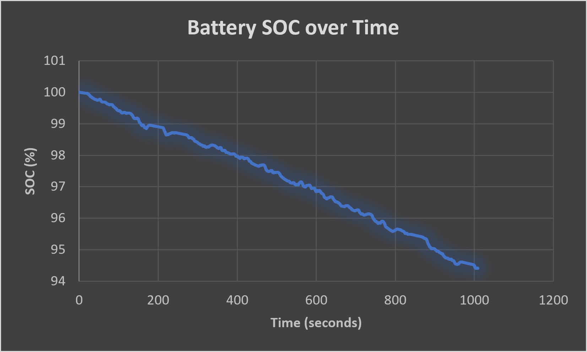
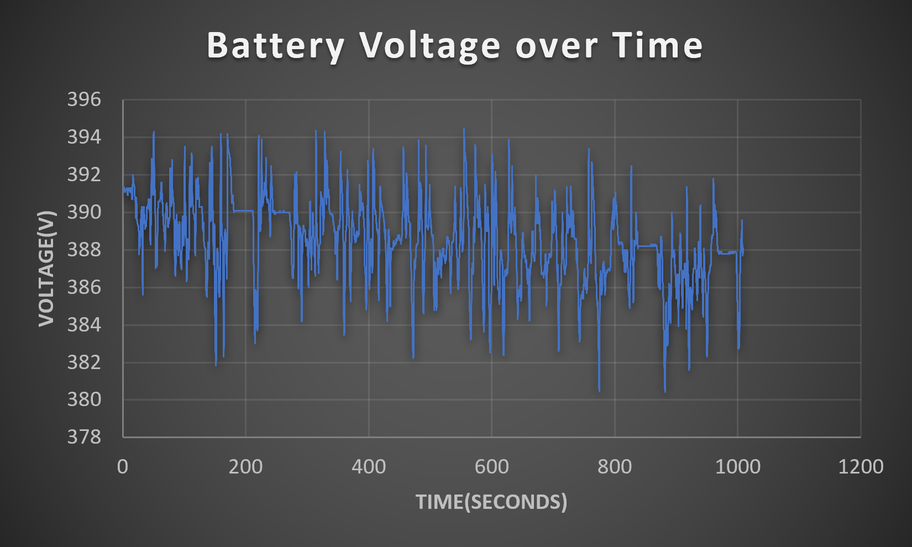
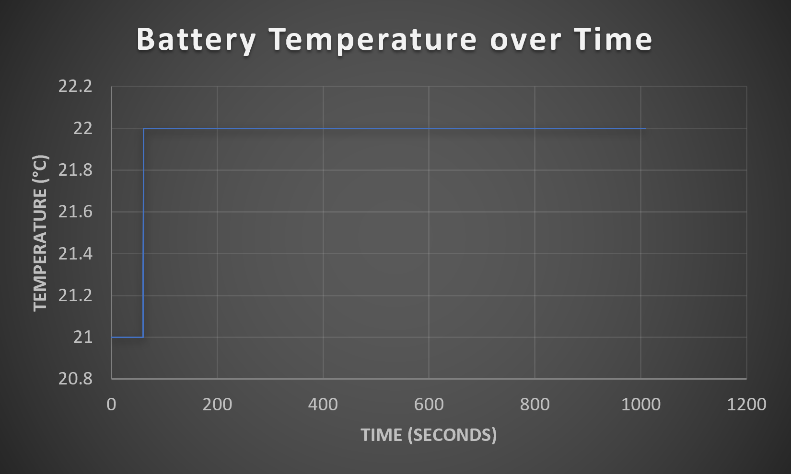
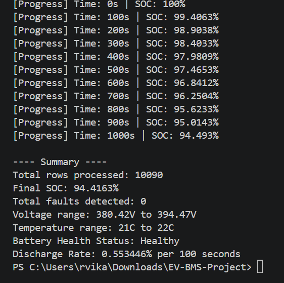

# EV Battery Management System (BMS) Simulation

## Problem Statement
Electric Vehicle batteries require continuous monitoring of State of Charge (SOC) and safety parameters to prevent failures like overheating or voltage extremes. This project simulates a core BMS module by analyzing real-world EV driving data.

## Dataset
Real-world EV driving data from "Battery and Heating Data in Real Driving Cycles" (TU Munich dataset, Kaggle) — includes actual voltage, current, and temperature readings recorded during real EV trips.

## What this project does
- Reads real EV trip data (10,000+ time-series records)
- Estimates State of Charge (SOC) using Coulomb Counting method
- Detects safety faults: over-voltage, under-voltage, over-temperature
- Classifies overall battery health status (Healthy / Moderate / Low)
- Calculates average discharge rate over the trip
- Tracks voltage and temperature ranges across the trip
- Logs SOC/voltage/temperature data over time for visualization

## Battery Health Dashboard

### State of Charge (SOC) over Time

### Battery Voltage over Time

### Battery Temperature over Time

**Observations:**
- SOC decreases steadily from 100% to ~94.4%, consistent with real-world discharge behavior
- Voltage fluctuates between 380V-396V due to real driving conditions (acceleration/braking)
- Temperature rises quickly from 21°C to 22°C, then stabilizes

## Sample Output

Total rows processed: 10090
Final SOC: 94.4163%
Total faults detected: 0
Voltage range: 380.42V to 394.47V
Temperature range: 21C to 22C
Battery Health Status: Healthy
Discharge Rate: 0.553446% per 100 seconds

## Fault Detection Validation
To verify fault detection logic works correctly, the temperature threshold was temporarily lowered to 21.5°C (below normal operating range) as a test:
- Result: 9,486 faults correctly detected
- Confirms threshold-based fault detection is functioning as intended
- Reverted to realistic threshold (45°C) for final results

## Assumptions
- Battery capacity assumed as 60 Ah (typical EV pack)
- Voltage safe range: 300V–420V
- Temperature safe limit: 45°C

## Tech Stack
- C++ (file I/O, string parsing, data processing)

## How to Run
1. Clone this repository
2. Ensure TripA01-selected-columns.csv is in the same folder as main.cpp
3. Compile: g++ main.cpp -o main
4. Run: ./main

## Future Improvements
- Add OCV (Open Circuit Voltage) based SOC correction to reduce coulomb-counting drift
- State of Health (SOH) estimation across multiple trips
- Interactive dashboard
